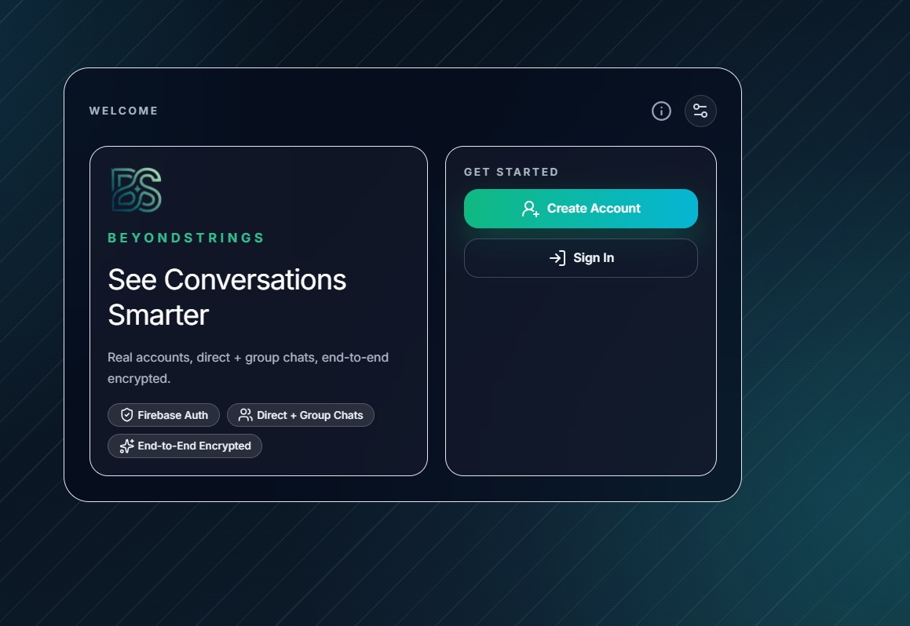
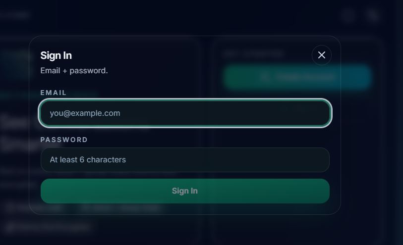
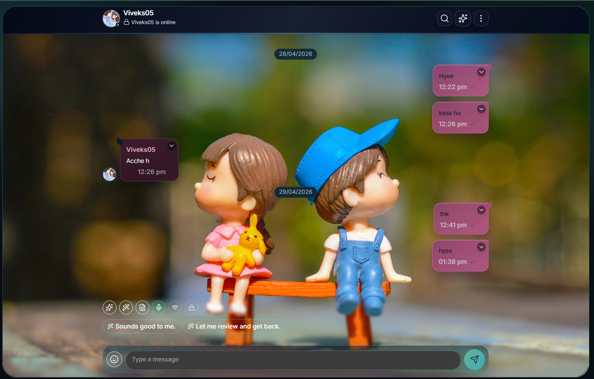
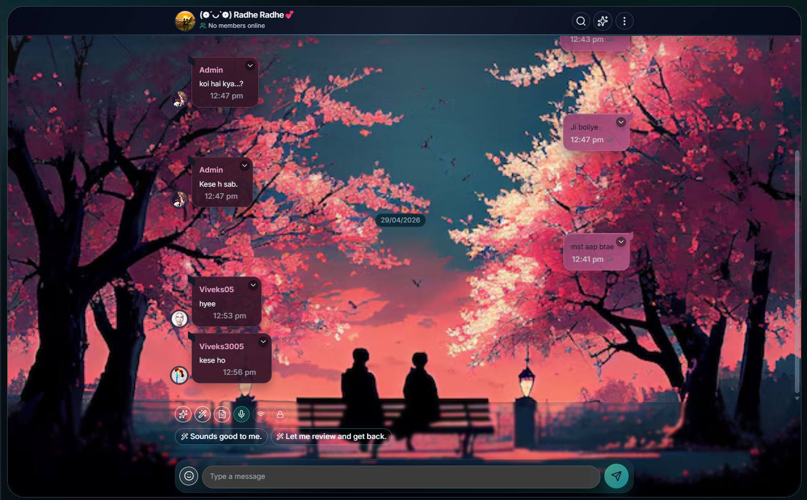
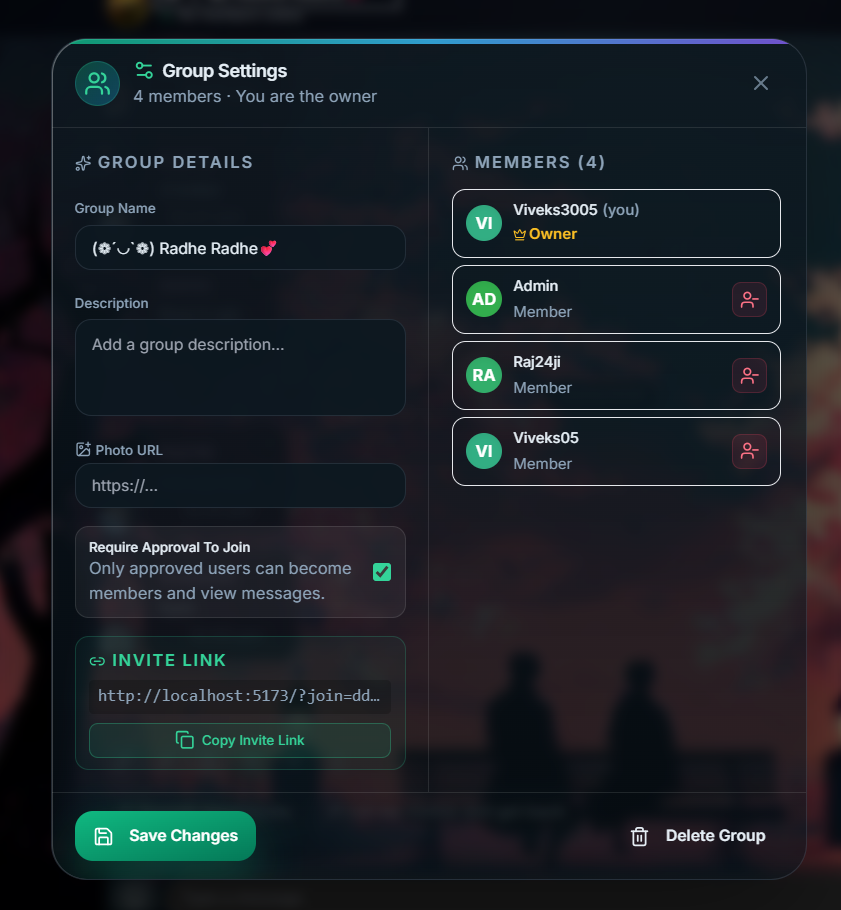
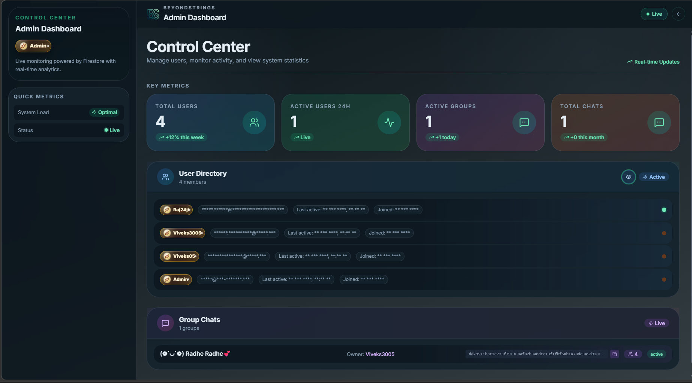

# BeyondStrings

BeyondStrings is a premium encrypted chat workspace built with React, Vite, Firebase, Redux, and serverless APIs.

## Branding

- App Name: `BeyondStrings`
- Tagline: `See Conversations Smarter`
- Primary branding config: `src/config/branding.js`
- Package name: `beyondstrings`
- PWA manifest name: `BeyondStrings` (`public/site.webmanifest`)

### Brand Assets (public)

- `favicon.ico`
- `favicon.svg`
- `favicon-96x96.png`
- `apple-touch-icon.png`
- `web-app-manifest-192x192.png`
- `web-app-manifest-512x512.png`

## Current Status

- Production build passing (Vite 5).
- Route-level lazy loading and runtime decomposition are active.
- Group chat lifecycle is complete (create, join, approval, manage, leave, delete).
- AI gateway routes and analytics endpoints are integrated.
- Background job worker processors are present for summaries, rollups, and cleanup.

## Core Features

### Messaging

- Firebase Auth and Firestore real-time chat
- Encrypted message payload (AES, CryptoJS)
- Presence, typing indicators, delivery and read states
- Offline queue with automatic reconnect sync
- Reply-to messages with persisted metadata in Firestore
- Emoji reactions (👍 ❤️ 😂 🔥) with per-message counts
- Message actions: reply, copy, forward, delete-for-me, delete-for-all

### Group Chat

- Create group chats with name, photo, and description
- Join by group ID (open join or approval-required flow)
- Join request queue with approve/reject for admins
- Member roles: owner, admin, member
- Group Settings panel: rename, photo, description, member list
- Remove member (admin/owner only)
- Leave group (non-owner members)
- Delete group for all (owner only)
- Rejoin after removal: re-submits join request automatically
- Login-time membership sync restores sidebar after relogin
- System messages for join, leave, remove events

### Presence & Reliability

- Real-time sync health indicator (Offline / Syncing / Degraded / Live)
- Richer unread counters stored per-member in Firestore
- Per-doc resilience: chat list continues loading on transient errors
- Self-healing `user_chats` materialization on send and read

### AI & Insights

- AI summary, assistant commands, semantic search, and reply suggestions
- Replay timeline with virtualization for large histories
- Chat insights panel with mood scoring and key-point extraction

### Backend & Platform

- Serverless API routes under `api/` (auth, AI, analytics, jobs, notifications, billing, export, search)
- Neon Postgres support (`DATABASE_URL`) for analytics/reporting paths
- Upstash Redis + BullMQ queue integration for async jobs
- Worker runtime in `worker/` with dedicated processors

### Other

- Imported chat archives (kept separate from live chat)
- Admin dashboard with user and group visibility (single-row responsive table)
- Profile page with avatar, username, and appearance settings

## Navigation

- `/home` — chat discovery, group creation, join by ID
- `/chat/:chatId` — live chat thread (direct or group)
- `/imported/:importedId` — imported chat archive thread
- `/profile` — user profile and appearance
- `/admin` — admin dashboard (role-gated)

## Architecture Snapshot

| File                                     | Role                                                   |
| ---------------------------------------- | ------------------------------------------------------ |
| `src/App.js`                             | Lightweight wrapper                                    |
| `src/RootApp.js`                         | Auth gate, route-level lazy loading, login-time sync   |
| `src/hooks/useLegacyChatRuntime.js`      | Main chat runtime: state, effects, handlers            |
| `src/features/chat/appRuntimeHelpers.js` | Pure helpers: timestamps, backgrounds, theme tokens    |
| `src/firebase/chatService.js`            | Firestore messages, presence, typing, reactions, reply |
| `src/firebase/socialService.js`          | Group management, membership, sync, join requests      |
| `src/firebase/userService.js`            | User profiles, search                                  |
| `src/components/ChatBubble.js`           | Message bubble with reply, reactions, action menu      |
| `src/components/ChatHeader.js`           | Sticky header with sync health, group title click      |
| `src/components/GroupSettingsPanel.js`   | Group settings modal: edit, member list, leave/delete  |
| `src/pages/Admin.js`                     | Admin dashboard with scrollable group table            |
| `api/ai.js`                              | AI gateway route with provider fallback chain           |
| `api/jobs/enqueue.js`                    | Job enqueue endpoint for async processing               |
| `worker/index.js`                        | Background worker bootstrap                             |

## Tech Stack

- React 18 + Vite 5
- Redux Toolkit + redux-persist (encrypted)
- Firebase Auth + Firestore
- Tailwind CSS + Framer Motion
- react-virtuoso for long-list rendering
- CryptoJS AES for client-side message encryption

## Setup

```bash
npm install
npm run dev
```

Open `http://localhost:5173`.

## Build

```bash
npm run build
npm run preview
```

## Scripts

```bash
npm run dev
npm run build
npm run preview
npm run migrate:group-approval:dry
npm run migrate:group-approval
```

## Environment Variables

Client (`.env.local`):

```env
PUBLIC_FIREBASE_API_KEY=
PUBLIC_FIREBASE_AUTH_DOMAIN=
PUBLIC_FIREBASE_PROJECT_ID=
PUBLIC_FIREBASE_STORAGE_BUCKET=
PUBLIC_FIREBASE_MESSAGING_SENDER_ID=
PUBLIC_FIREBASE_APP_ID=
PUBLIC_REDUX_PERSIST_SECRET=
PUBLIC_IMPORTED_CHAT_SECRET=
PUBLIC_MESSAGE_TONE_URL=
PUBLIC_API_BASE_URL=/api
PUBLIC_FIREBASE_VAPID_KEY=
PUBLIC_AI_GATEWAY_ENABLED=true
PUBLIC_AI_PROVIDER_ORDER=openai,gemini,ollama,local
```

Server (Vercel / `.env`):

```env
FIREBASE_PROJECT_ID=
FIREBASE_CLIENT_EMAIL=
FIREBASE_PRIVATE_KEY=
FIREBASE_STORAGE_BUCKET=
DATABASE_URL=
UPSTASH_REDIS_REST_URL=
UPSTASH_REDIS_REST_TOKEN=
REDIS_URL=
OPENAI_API_KEY=
OPENAI_MODEL=gpt-4o-mini
GEMINI_API_KEY=
GEMINI_MODEL=gemini-1.5-flash
OLLAMA_BASE_URL=http://127.0.0.1:11434
OLLAMA_MODEL=llama3.2:3b
AI_GATEWAY_MAX_MESSAGES=200
AI_GATEWAY_MAX_MESSAGE_CHARS=1000
AI_GATEWAY_MAX_QUERY_CHARS=800
AI_GATEWAY_MAX_TOTAL_CHARS=32000
AI_GATEWAY_RATE_WINDOW_MS=60000
AI_GATEWAY_RATE_LIMIT=30
GOOGLE_APPLICATION_CREDENTIALS=
```

## Firestore Rules

Deploy with:

```bash
firebase deploy --only firestore:rules
```

Key rules:

- Members can read/write messages in chats they belong to
- Group owners can manage member roles and settings
- Join requests: users can create and re-submit (rejoin flow)
- Legacy groups (no `joinPolicy` field) treated as open-join

## Notes

- Imported chats and live chats are intentionally separated in state and routing.
- Group secret for encryption is derived as `grp:{chatId}`.
- Group owner cannot leave — must use delete group instead.
- Settings and insights panels are loaded lazily.

## Screenshots

<table>
  <tr>
    <td align="center" width="33%">
      
      <br/>
      <sub>Welcome Screen</sub>
      <br/>
      <sub><a href="screenshots/welcome-screen.png">PNG</a> | <a href="screenshots/welcome-screen.svg">SVG</a></sub>
    </td>
    <td align="center" width="33%">
      
      <br/>
      <sub>Login</sub>
      <br/>
      <sub><a href="screenshots/login-screen.png">PNG</a> | <a href="screenshots/login-screen.svg">SVG</a></sub>
    </td>
    <td align="center" width="33%">
      
      <br/>
      <sub>Private Chats</sub>
      <br/>
      <sub><a href="screenshots/private-chats.png">PNG</a> | <a href="screenshots/private-chats.svg">SVG</a></sub>
    </td>
  </tr>
  <tr>
    <td align="center" width="33%">
      
      <br/>
      <sub>Group Chats</sub>
      <br/>
      <sub><a href="screenshots/group-chats.png">PNG</a> | <a href="screenshots/group-chats.svg">SVG</a></sub>
    </td>
    <td align="center" width="33%">
      
      <br/>
      <sub>Group Settings</sub>
      <br/>
      <sub><a href="screenshots/group-settings.png">PNG</a> | <a href="screenshots/group-settings.svg">SVG</a></sub>
    </td>
    <td align="center" width="33%">
      
      <br/>
      <sub>Admin Dashboard</sub>
      <br/>
      <sub><a href="screenshots/admin-dashboard.png">PNG</a> | <a href="screenshots/admin-dashboard.svg">SVG</a></sub>
    </td>
  </tr>
</table>
